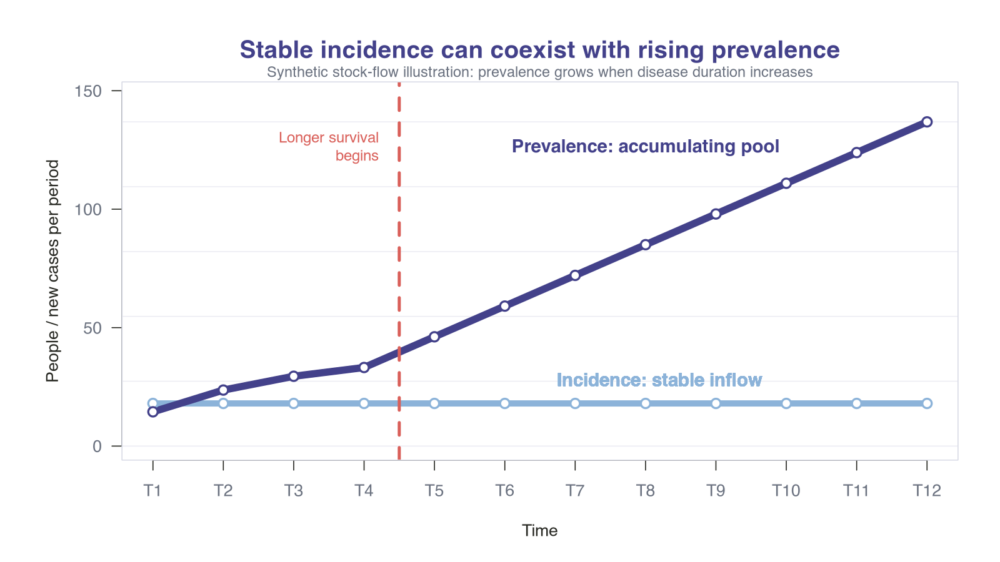
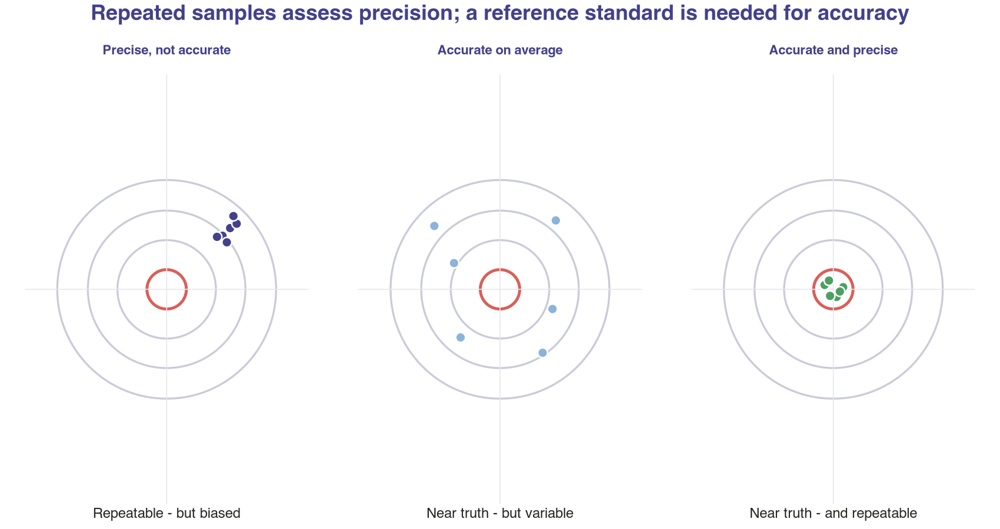
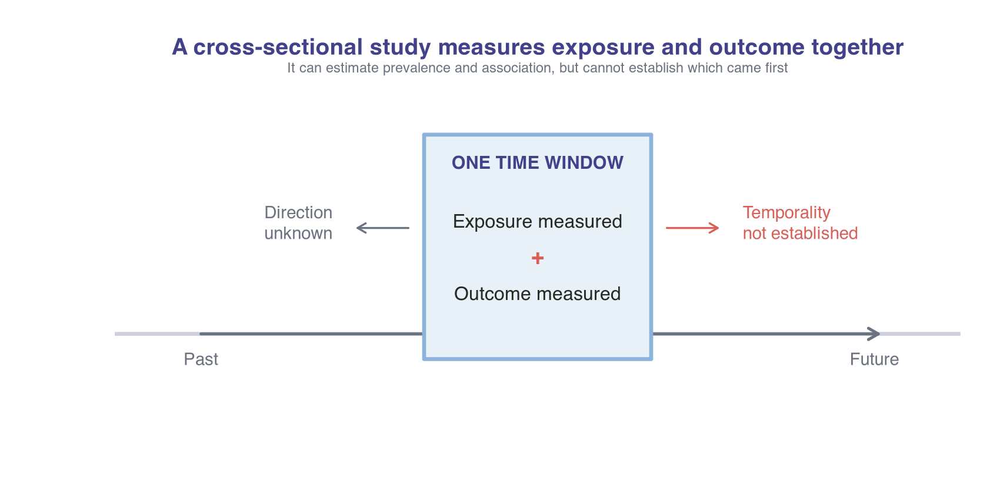
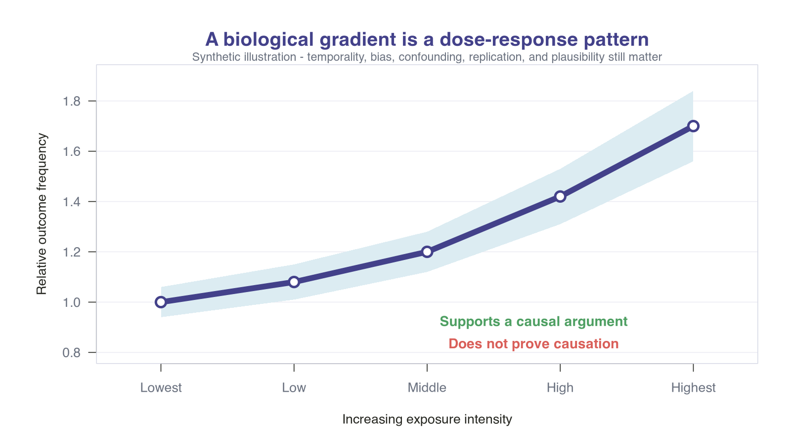
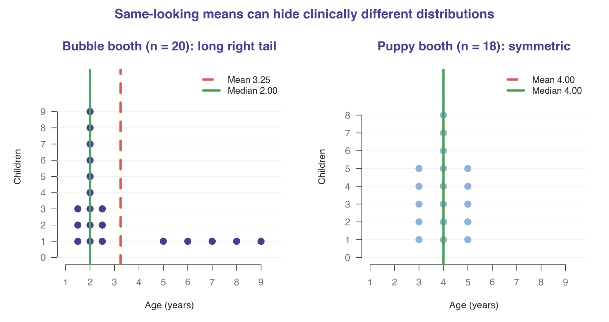
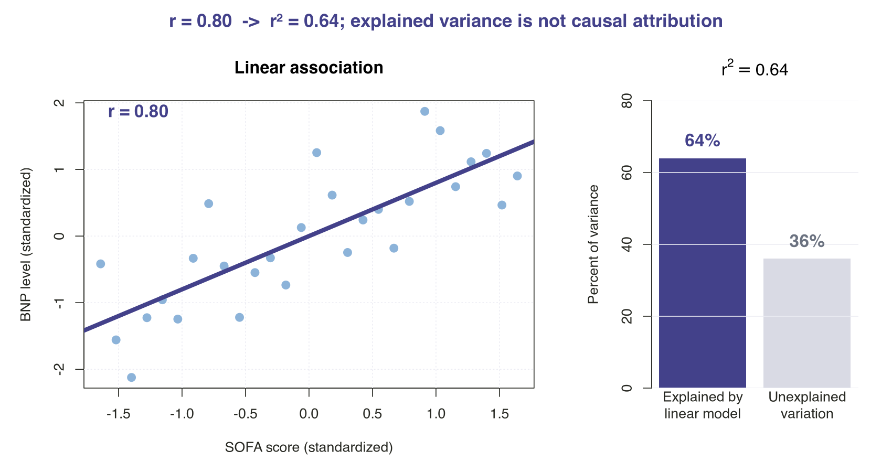
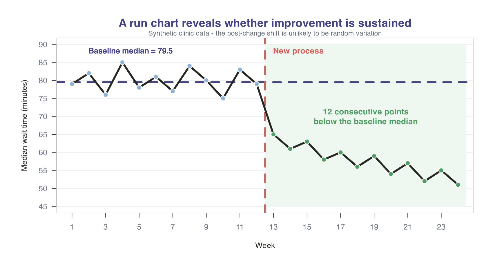

## Learning Objectives

By the end of this session, you should be able to:

:::{.incremental}
- **Classify** disease frequency, measurement properties, and study designs in at least 8 of 10 PREP vignettes.
- **Choose** the design that best answers a descriptive, associative, or causal question.
- **Calculate and interpret** r² from a reported correlation coefficient.
- **Distinguish** evidence that supports causation from evidence that proves only association.
- **Recognize** a nonrandom shift on a run chart after a process change.
:::

---

## How We'll Work Through Questions

:::{.incremental}
- Read the clinical vignette and commit to one answer.
- Take 20-30 seconds for individual thought or pair-share.
- Submit the answer to reveal the short explanation.
- Debrief the governing concept, the distractors, and a visual anchor.
- Separate what the data **show** from what we are tempted to **claim**.
:::

# Part 1: Measurement Before Modeling {background-color="#43418A"}

Start with what is being counted - and what a test can actually tell you.

---

## Question 1

:::: {#quiz-container-1 .quiz-container}
<p class="question">
The history of treatment strategies for different renal conditions is being discussed among a team of residents. They discuss that the number of children born with cystinosis has not changed over the past 2 decades. With treatments like kidney transplantation and cysteamine, patients are living longer but are not cured of their disease.
<br><br>
Of the following, the BEST description of the overall incidence and prevalence of cystinosis is
</p>

<form id="quiz-form-1">
  <label><input type="radio" name="answer-1" value="A"><span class="answer-text"><span class="answer-letter">A.</span> Increased incidence; increased prevalence</span></label>
  <label><input type="radio" name="answer-1" value="B"><span class="answer-text"><span class="answer-letter">B.</span> Increased incidence; stable prevalence</span></label>
  <label><input type="radio" name="answer-1" value="C"><span class="answer-text"><span class="answer-letter">C.</span> Stable incidence; increased prevalence</span></label>
  <label><input type="radio" name="answer-1" value="D"><span class="answer-text"><span class="answer-letter">D.</span> Stable incidence; stable prevalence</span></label>
  <button type="submit">Submit Answer</button>
</form>
<div id="result-1" class="quiz-result" aria-live="polite"></div>
::::

<p class="source-line">AAP PREP source question 10</p>

:::{.notes}
[Sources]
- American Academy of Pediatrics. Basic PREP Statistics Assessment, Question 10. Learner-mode export dated August 28, 2025.
:::

---

## Longer Duration Raises Prevalence

**Correct Answer: C. Stable incidence; increased prevalence**

:::{.incremental}
- **Incidence** is the flow of new cases over time. The number of affected births is unchanged.
- **Prevalence** is the pool of people currently living with disease.
- Longer survival increases average disease duration, so the pool grows even when inflow is stable.
- The useful approximation is: **prevalence ≈ incidence × average duration**.
:::

<div class="callout-caution"><strong>Clinical interpretation:</strong> More people living with a condition does not necessarily mean more new disease.</div>

:::{.notes}
[Sources]
- American Academy of Pediatrics. Basic PREP Statistics Assessment, Question 10. Learner-mode export.
- The prevalence approximation assumes a roughly steady state and is less reliable when incidence, migration, or survival changes rapidly.
:::

---

## Stable Incidence, Expanding Pool {.visual-slide}



:::{.notes}
[Sources]
- Synthetic illustration generated for this lecture; no patient data.
- American Academy of Pediatrics. Basic PREP Statistics Assessment, Question 10. Learner-mode export.
:::

---

## Why the Other Choices Fail

:::{.incremental}
- **A and B:** Increased incidence would require more new diagnoses or affected births per unit time; the stem says that number is unchanged.
- **B and D:** Stable prevalence would require the larger surviving pool to be offset by fewer new cases, cure, death, or out-migration.
- Better treatment can increase prevalence while improving outcomes - a useful reminder that prevalence is not a quality metric by itself.
:::

---

## Question 2

:::: {#quiz-container-2 .quiz-container}
<p class="question">
A laboratory technology company is trying to conduct a study on its new saliva-based test for group A streptococcus. Company investigators plan on obtaining 3 saliva samples from children who seek treatment in an emergency department for sore throat. The specimen obtained with each swab will be tested using a new rapid antigen detection test.
<br><br>
Of the following, the attribute of this test that could BEST be evaluated in the study is
</p>

<form id="quiz-form-2">
  <label><input type="radio" name="answer-2" value="A"><span class="answer-text"><span class="answer-letter">A.</span> accuracy</span></label>
  <label><input type="radio" name="answer-2" value="B"><span class="answer-text"><span class="answer-letter">B.</span> positive predictive value</span></label>
  <label><input type="radio" name="answer-2" value="C"><span class="answer-text"><span class="answer-letter">C.</span> precision</span></label>
  <label><input type="radio" name="answer-2" value="D"><span class="answer-text"><span class="answer-letter">D.</span> sensitivity</span></label>
  <button type="submit">Submit Answer</button>
</form>
<div id="result-2" class="quiz-result" aria-live="polite"></div>
::::

<p class="source-line">AAP PREP source question 24</p>

:::{.notes}
[Sources]
- American Academy of Pediatrics. Basic PREP Statistics Assessment, Question 24. Learner-mode export.
:::

---

## Repeat Testing Measures Precision

**Correct Answer: C. precision**

:::{.incremental}
- Three samples from the same child test **repeatability**: do repeated measurements agree?
- That is **precision** (or reliability), not necessarily truth.
- **Accuracy**, sensitivity, and predictive values require a reference standard that classifies disease status.
- A test can be consistently wrong: high precision, low accuracy.
:::

<div class="callout-method"><strong>Design principle:</strong> Repetition estimates variability. Comparison with truth estimates diagnostic accuracy.</div>

:::{.notes}
[Sources]
- American Academy of Pediatrics. Basic PREP Statistics Assessment, Question 24. Learner-mode export.
- US Food and Drug Administration. Statistical Guidance on Reporting Results from Studies Evaluating Diagnostic Tests. https://www.fda.gov/regulatory-information/search-fda-guidance-documents/statistical-guidance-reporting-results-studies-evaluating-diagnostic-tests-guidance-industry-and-fda
:::

---

## Precision Is Not Accuracy {.visual-slide}



:::{.notes}
[Sources]
- Synthetic illustration generated for this lecture; no patient data.
- US Food and Drug Administration. Statistical Guidance on Reporting Results from Studies Evaluating Diagnostic Tests. Inspected 2026-08-27.
:::

# Part 2: Match the Design to the Question {background-color="#43418A"}

Ask whether the goal is to describe, associate, or estimate a causal treatment effect.

---

## Question 3

:::: {#quiz-container-3 .quiz-container}
<p class="question compact">
A practice seeks to decrease obesity rates as a way to improve population health and is looking to identify risk factors that may be associated with obesity. The team hypothesizes that children who play video games for more than 2 hours a day have higher body mass index (BMI) percentiles. During one month, a survey records BMI percentile and daily video-game hours at each enrolled child's annual health supervision visit.
<br><br>
The results are: among 200 children with less than 2 hours/day, 40 have BMI above the 95th percentile; among 100 children with more than 2 hours/day, 50 have BMI above the 95th percentile.
<br><br>
Of the following, the study DESIGN used by the practice was
</p>

<form id="quiz-form-3">
  <label><input type="radio" name="answer-3" value="A"><span class="answer-text"><span class="answer-letter">A.</span> case-control</span></label>
  <label><input type="radio" name="answer-3" value="B"><span class="answer-text"><span class="answer-letter">B.</span> cross-sectional</span></label>
  <label><input type="radio" name="answer-3" value="C"><span class="answer-text"><span class="answer-letter">C.</span> randomized controlled</span></label>
  <label><input type="radio" name="answer-3" value="D"><span class="answer-text"><span class="answer-letter">D.</span> retrospective cohort</span></label>
  <button type="submit">Submit Answer</button>
</form>
<div id="result-3" class="quiz-result" aria-live="polite"></div>
::::

<p class="source-line">AAP PREP source question 20; stem condensed without changing design-defining facts</p>

:::{.notes}
[Sources]
- American Academy of Pediatrics. Basic PREP Statistics Assessment, Question 20. Learner-mode export. The visible stem is condensed; counts and timing are unchanged.
:::

---

## One Time Window Means Cross-Sectional

**Correct Answer: B. cross-sectional**

:::{.incremental}
- Exposure and outcome are measured in the same short window.
- The design estimates **prevalence** and can quantify an **association**.
- Because timing is unresolved, it cannot tell whether gaming preceded higher BMI.
- It is efficient for hypothesis generation, but vulnerable to confounding and reverse causation.
:::

:::{.notes}
[Sources]
- Mann CJ. Observational research methods. Research design II: cohort, cross sectional, and case-control studies. Emerg Med J. 2003;20:54-60. PMID 12533370; PMCID PMC1726024; doi:10.1136/emj.20.1.54.
- American Academy of Pediatrics. Basic PREP Statistics Assessment, Question 20. Learner-mode export.
:::

---

## Cross-Sectional = Snapshot {.visual-slide}



:::{.notes}
[Sources]
- Synthetic illustration generated for this lecture; no patient data.
- Mann CJ. Emerg Med J. 2003;20:54-60. doi:10.1136/emj.20.1.54.
:::

---

## Study Design Starts With Direction

| Start with... | Then ask... | Typical design | What it estimates best |
|---|---|---|---|
| A population now | Exposure and outcome together | Cross-sectional | Prevalence; association |
| An exposure | Who later develops outcome? | Cohort | Incidence; risk ratio |
| An outcome | What prior exposures differed? | Case-control | Odds ratio |
| An intervention | What happens after random allocation? | Randomized trial | Causal treatment effect |

<div class="callout-caution"><strong>Shortcut to avoid:</strong> “Retrospective” describes when data were collected, not the design by itself.</div>

:::{.notes}
[Sources]
- Mann CJ. Observational research methods. Research design II: cohort, cross sectional, and case-control studies. Emerg Med J. 2003;20:54-60. PMID 12533370; PMCID PMC1726024; doi:10.1136/emj.20.1.54.
:::

---

## Question 4

:::: {#quiz-container-4 .quiz-container}
<p class="question compact">
An 8-year-old boy with asthma has had 3 exacerbations in 6 months. His mother asks about an herbal supplement after reading comments from parents whose children had fewer attacks while taking it.
<br><br>
Of the following, the MOST valid way to assess the causal effect of this herbal supplement in children with asthma is to perform a
</p>

<form id="quiz-form-4">
  <label><input type="radio" name="answer-4" value="A"><span class="answer-text"><span class="answer-letter">A.</span> cohort study</span></label>
  <label><input type="radio" name="answer-4" value="B"><span class="answer-text"><span class="answer-letter">B.</span> cross-sectional study</span></label>
  <label><input type="radio" name="answer-4" value="C"><span class="answer-text"><span class="answer-letter">C.</span> randomized controlled trial</span></label>
  <label><input type="radio" name="answer-4" value="D"><span class="answer-text"><span class="answer-letter">D.</span> retrospective chart review</span></label>
  <button type="submit">Submit Answer</button>
</form>
<div id="result-4" class="quiz-result" aria-live="polite"></div>
::::

<p class="source-line">AAP PREP source question 22; stem condensed without changing the causal question</p>

:::{.notes}
[Sources]
- American Academy of Pediatrics. Basic PREP Statistics Assessment, Question 22. Learner-mode export. The stem is condensed for slide legibility.
:::

---

## Randomization Best Supports a Causal Effect

**Correct Answer: C. randomized controlled trial**

<div class="flow-row">
  <div class="flow-node"><strong>Eligible children</strong></div>
  <div class="flow-arrow">→</div>
  <div class="flow-node"><strong>Random allocation</strong></div>
  <div class="flow-arrow">→</div>
  <div class="flow-node"><strong>Compare prespecified outcomes</strong></div>
</div>

:::{.incremental}
- Randomization makes treatment assignment independent of prognosis on average.
- A concurrent comparator estimates what would have happened without the supplement.
- Blinding, allocation concealment, follow-up, adherence, and outcome definition still determine validity.
:::

:::{.notes}
[Sources]
- Altman DG, Bland JM. Randomisation methods in controlled trials. BMJ. 1998;317:1301. doi:10.1136/bmj.317.7168.1301.
- American Academy of Pediatrics. Basic PREP Statistics Assessment, Question 22. Learner-mode export.
:::

---

## Why Not the Observational Designs?

:::{.incremental}
- **Cohort:** treatment choice may track asthma severity, family preferences, access, and co-interventions.
- **Cross-sectional:** exposure and outcome are measured together; temporality is unresolved.
- **Chart review:** this is a data-collection method, not a guarantee of a particular design or causal contrast.
- Statistical adjustment can address measured confounders; randomization also protects against unmeasured confounding on average.
:::

---

## Question 5

:::: {#quiz-container-5 .quiz-container}
<p class="question compact">
An infectious diseases fellow has cared for 3 very different children with probable new hemophagocytic lymphohistiocytosis (HLH) this month. A colleague identifies 5 additional pediatric cases from the past 2 years. There is little pediatric literature, and the team wants to contribute detailed observations about this rare disorder.
<br><br>
Of the following, the MOST appropriate study design is a
</p>

<form id="quiz-form-5">
  <label><input type="radio" name="answer-5" value="A"><span class="answer-text"><span class="answer-letter">A.</span> case-control study</span></label>
  <label><input type="radio" name="answer-5" value="B"><span class="answer-text"><span class="answer-letter">B.</span> case series study</span></label>
  <label><input type="radio" name="answer-5" value="C"><span class="answer-text"><span class="answer-letter">C.</span> cross-sectional study</span></label>
  <label><input type="radio" name="answer-5" value="D"><span class="answer-text"><span class="answer-letter">D.</span> prospective cohort study</span></label>
  <button type="submit">Submit Answer</button>
</form>
<div id="result-5" class="quiz-result" aria-live="polite"></div>
::::

<p class="source-line">AAP PREP source question 23; stem condensed without changing design-defining facts</p>

:::{.notes}
[Sources]
- American Academy of Pediatrics. Basic PREP Statistics Assessment, Question 23. Learner-mode export. The stem is condensed for slide legibility.
:::

---

## Rare and Descriptive Favors a Case Series

**Correct Answer: B. case series study**

<div class="three-col">
  <div class="flat-panel"><h3>Useful for</h3><p>Detailed phenotype, presentation, management, and hypothesis generation.</p></div>
  <div class="flat-panel"><h3>Cannot estimate</h3><p>Incidence, relative risk, or causal effect without a denominator or comparator.</p></div>
  <div class="flat-panel"><h3>Watch for</h3><p>Selection, missing records, publication bias, and overgeneralization.</p></div>
</div>

<div class="callout-key"><strong>Right tool, right claim:</strong> A case series can be the best first design for a rare condition even though it sits low in an intervention-evidence hierarchy.</div>

:::{.notes}
[Sources]
- Nissen T, Wynn R. The clinical case report: a review of its merits and limitations. BMC Res Notes. 2014;7:264. PMID 24758689; PMCID PMC4001358; doi:10.1186/1756-0500-7-264.
- American Academy of Pediatrics. Basic PREP Statistics Assessment, Question 23. Learner-mode export.
:::

---

## Question 6

:::: {#quiz-container-6 .quiz-container}
<p class="question compact">
Patients with hypercholesterolemia are randomized by drawing a numbered paper from a bag. Odd numbers receive a very low-fat diet; even numbers receive a statin. A dietitian investigator instructs participants assigned to the diet. Outcomes are cholesterol and body mass index at 6 months.
<br><br>
Of the following study designs, this randomized study is an example of a/an
</p>

<form id="quiz-form-6">
  <label><input type="radio" name="answer-6" value="A"><span class="answer-text"><span class="answer-letter">A.</span> crossover study</span></label>
  <label><input type="radio" name="answer-6" value="B"><span class="answer-text"><span class="answer-letter">B.</span> double-blind study</span></label>
  <label><input type="radio" name="answer-6" value="C"><span class="answer-text"><span class="answer-letter">C.</span> open-label study</span></label>
  <label><input type="radio" name="answer-6" value="D"><span class="answer-text"><span class="answer-letter">D.</span> single-blinded study</span></label>
  <button type="submit">Submit Answer</button>
</form>
<div id="result-6" class="quiz-result" aria-live="polite"></div>
::::

<p class="source-line">AAP PREP source question 25; stem condensed without changing masking facts</p>

:::{.notes}
[Sources]
- American Academy of Pediatrics. Basic PREP Statistics Assessment, Question 25. Learner-mode export. The stem is condensed for slide legibility.
:::

---

## The Intervention Makes Masking Impossible

**Correct Answer: C. open-label study**

| Trial description | Participants know? | Treating team knows? | Outcome assessor knows? |
|---|:---:|:---:|:---:|
| Open-label | <span class="check">Yes</span> | <span class="check">Yes</span> | May or may not |
| Participant-masked | <span class="cross">No</span> | <span class="check">Yes</span> | May or may not |
| Double-masked | <span class="cross">No</span> | <span class="cross">No</span> | Ideally no |

:::{.incremental}
- Diet versus medication is apparent to participants and the clinical team.
- Randomization and masking solve different problems: allocation bias versus performance/assessment bias.
- Objective outcomes and blinded outcome assessment can reduce bias when full masking is infeasible.
:::

:::{.notes}
[Sources]
- Kahan BC, Cro S, Dore CJ, et al. Reducing bias in open-label trials where blinded outcome assessment is not feasible. Trials. 2014;15:456. doi:10.1186/1745-6215-15-456.
- American Academy of Pediatrics. Basic PREP Statistics Assessment, Question 25. Learner-mode export.
:::

# Part 3: Association, Assumptions & Interpretation {background-color="#43418A"}

The test statistic is only as honest as the design and the claim attached to it.

---

## Question 7

:::: {#quiz-container-7 .quiz-container}
<p class="question compact">
A public health analysis reports increased autism rates in areas adjacent to cellular telephone towers. Commentators suggest that tower radiation harms the developing brain. Physicians discuss the distinction between correlation and causation.
<br><br>
Of the following, the finding MOST likely to support a causative relationship is
</p>

<form id="quiz-form-7">
  <label><input type="radio" name="answer-7" value="A"><span class="answer-text"><span class="answer-letter">A.</span> children who live closer to cellular phone towers have proportionally higher rates of autism</span></label>
  <label><input type="radio" name="answer-7" value="B"><span class="answer-text"><span class="answer-letter">B.</span> the increase in autism prevalence has paralleled increases in cell phone tower concentration</span></label>
  <label><input type="radio" name="answer-7" value="C"><span class="answer-text"><span class="answer-letter">C.</span> parents with higher educational backgrounds are more likely to live near cellular phone towers</span></label>
  <label><input type="radio" name="answer-7" value="D"><span class="answer-text"><span class="answer-letter">D.</span> rates of autism tend to be higher in developed countries, which have a higher density of cell phone towers</span></label>
  <button type="submit">Submit Answer</button>
</form>
<div id="result-7" class="quiz-result" aria-live="polite"></div>
::::

<p class="source-line">AAP PREP source question 18 - association-only teaching vignette, not evidence of a causal link</p>

:::{.notes}
[Sources]
- American Academy of Pediatrics. Basic PREP Statistics Assessment, Question 18. Learner-mode export. This vignette is used only to teach causal reasoning and is not presented as evidence that cellular telephone towers cause autism.
:::

---

## Dose-Response Supports, but Does Not Prove

**Correct Answer: A. proportional increase with closer proximity**

:::{.incremental}
- A graded relationship between increasing exposure and outcome is a **biological gradient**.
- It strengthens a causal argument because the pattern is more specific than simple co-occurrence.
- It still does not resolve confounding, exposure misclassification, selection, diagnostic ascertainment, or reverse causation.
- Hill described causal **viewpoints**, not a checklist that mechanically proves causation.
:::

<div class="callout-caution"><strong>Guardrail:</strong> The question asks which result would add support. None of these observational findings alone establishes causality.</div>

:::{.notes}
[Sources]
- Hill AB. The Environment and Disease: Association or Causation? Proc R Soc Med. 1965;58:295-300. PMID 14283879; PMCID PMC1898525; doi:10.1177/003591576505800503.
- American Academy of Pediatrics. Basic PREP Statistics Assessment, Question 18. Learner-mode export.
:::

---

## One Piece of a Causal Argument {.visual-slide}



:::{.notes}
[Sources]
- Synthetic illustration generated for this lecture; no patient data.
- Hill AB. Proc R Soc Med. 1965;58:295-300. PMID 14283879; PMCID PMC1898525; doi:10.1177/003591576505800503.
:::

---

## Question 8

:::: {#quiz-container-8 .quiz-container}
<p class="question very-compact">
Two physicians test which festival booth better attracts parents of children under age 3. The puppy booth attracts five 3-year-olds, eight 4-year-olds, and five 5-year-olds. The bubble booth attracts three 18-month-olds, nine 24-month-olds, three 30-month-olds, and one child each aged 5, 6, 7, 8, and 9 years. A t test finds no statistically significant difference in mean age.
<br><br>
Of the following, the t test is NOT an appropriate choice because the
</p>

<form id="quiz-form-8">
  <label><input type="radio" name="answer-8" value="A"><span class="answer-text"><span class="answer-letter">A.</span> data are not continuous</span></label>
  <label><input type="radio" name="answer-8" value="B"><span class="answer-text"><span class="answer-letter">B.</span> data are not normally distributed</span></label>
  <label><input type="radio" name="answer-8" value="C"><span class="answer-text"><span class="answer-letter">C.</span> samples are not independent</span></label>
  <label><input type="radio" name="answer-8" value="D"><span class="answer-text"><span class="answer-letter">D.</span> sample sizes are small</span></label>
  <button type="submit">Submit Answer</button>
</form>
<div id="result-8" class="quiz-result" aria-live="polite"></div>
::::

<p class="source-line">AAP PREP source question 15; all ages and counts retained</p>

:::{.notes}
[Sources]
- American Academy of Pediatrics. Basic PREP Statistics Assessment, Question 15. Learner-mode export. All ages and counts are retained; framing is shortened for slide legibility.
:::

---

## The Mean Hides a Long Tail

**Correct Answer: B. data are not normally distributed**

:::{.incremental}
- Age is continuous enough for this analysis, and the two booth samples are independent.
- The bubble sample is strongly right-skewed; a few older siblings pull its mean upward.
- Bubble booth: mean 3.25 years, median 2 years. Puppy booth: mean = median = 4 years.
- For the PREP question, the severe skew makes the conventional t test a poor summary of the scientific question.
:::

<div class="callout-method"><strong>Nuance:</strong> The Mann-Whitney U test compares distributions/ranks, not automatically means or medians. Choose the estimand first; then choose a method robust to the data-generating process.</div>

:::{.notes}
[Sources]
- American Academy of Pediatrics. Basic PREP Statistics Assessment, Question 15. Learner-mode export. Its exact data yield the displayed means and medians.
- The final nuance distinguishes the Mann-Whitney estimand from a mean comparison; it is included to avoid the common oversimplification that “nonnormal always means Mann-Whitney.”
:::

---

## Look at the Distribution First {.visual-slide}



:::{.notes}
[Sources]
- American Academy of Pediatrics. Basic PREP Statistics Assessment, Question 15. Learner-mode export. Plotted values exactly reproduce the source stem; no patient data.
:::

---

## Question 9

:::: {#quiz-container-9 .quiz-container}
<p class="question compact">
A prospective observational trial in mechanically ventilated, critically ill adult patients with sepsis reports an association between day-1 brain natriuretic peptide (BNP) levels and maximum Sequential Organ Failure Assessment (SOFA) score. The correlation coefficient is r = 0.800.
<br><br>
Of the following, the value that BEST estimates the proportion of variation in BNP levels statistically explained by the SOFA score is
</p>

<form id="quiz-form-9">
  <label><input type="radio" name="answer-9" value="A"><span class="answer-text"><span class="answer-letter">A.</span> 0.360</span></label>
  <label><input type="radio" name="answer-9" value="B"><span class="answer-text"><span class="answer-letter">B.</span> 0.640</span></label>
  <label><input type="radio" name="answer-9" value="C"><span class="answer-text"><span class="answer-letter">C.</span> 0.800</span></label>
  <label><input type="radio" name="answer-9" value="D"><span class="answer-text"><span class="answer-letter">D.</span> 0.894</span></label>
  <button type="submit">Submit Answer</button>
</form>
<div id="result-9" class="quiz-result" aria-live="polite"></div>
::::

<p class="source-line">AAP PREP source question 16; adult source population</p>

:::{.notes}
[Sources]
- American Academy of Pediatrics. Basic PREP Statistics Assessment, Question 16. Learner-mode export. The source population is adult; the statistical calculation is population-agnostic, but the clinical association should not be generalized to children without pediatric evidence.
:::

---

## Square r to Obtain Explained Variance

**Correct Answer: B. 0.640**

<div class="big-equation">r² = (0.800)² = 0.640 = 64%</div>

:::{.incremental}
- r gives the direction and strength of a linear association.
- r² is the fraction of outcome variance explained by that fitted linear relationship in the sample.
- The remaining 36% is not explained by this one-predictor linear model.
- **Explained variance is not causal attribution.** Confounding and shared causes can produce correlation.
:::

<div class="callout-caution"><strong>Pediatric distinction:</strong> The calculation transfers across populations; the adult sepsis relationship itself does not.</div>

:::{.notes}
[Sources]
- Schober P, Boer C, Schwarte LA. Correlation Coefficients: Appropriate Use and Interpretation. Anesth Analg. 2018;126:1763-1768. PMID 29481436; doi:10.1213/ANE.0000000000002864.
- American Academy of Pediatrics. Basic PREP Statistics Assessment, Question 16. Learner-mode export.
:::

---

## r = 0.80 Does Not Mean 80% Explained {.visual-slide}



:::{.notes}
[Sources]
- Synthetic illustration generated for this lecture; no patient data. The point coordinates were constructed to have r = 0.80.
- Schober P, Boer C, Schwarte LA. Anesth Analg. 2018;126:1763-1768. PMID 29481436; doi:10.1213/ANE.0000000000002864.
:::

# Part 4: Improvement Happens Over Time {background-color="#43418A"}

A before-and-after average can miss the process story.

---

## Question 10

:::: {#quiz-container-10 .quiz-container}
<p class="question compact">
To reduce wait times for patients to receive chemotherapy during oncology clinic visits, a new procedure is implemented for ordering laboratory tests and writing chemotherapy orders before the visit. Six months later, clinic leaders request an update.
<br><br>
Which display is MOST appropriate for determining whether this procedure reduced wait times?
</p>

<form id="quiz-form-10">
  <label><input type="radio" name="answer-10" value="A"><span class="answer-text"><span class="answer-letter">A.</span> Ishikawa fishbone diagram</span></label>
  <label><input type="radio" name="answer-10" value="B"><span class="answer-text"><span class="answer-letter">B.</span> key driver diagram</span></label>
  <label><input type="radio" name="answer-10" value="C"><span class="answer-text"><span class="answer-letter">C.</span> Pareto chart</span></label>
  <label><input type="radio" name="answer-10" value="D"><span class="answer-text"><span class="answer-letter">D.</span> run chart</span></label>
  <button type="submit">Submit Answer</button>
</form>
<div id="result-10" class="quiz-result" aria-live="polite"></div>
::::

<p class="source-line">AAP PREP source question 44</p>

:::{.notes}
[Sources]
- American Academy of Pediatrics. Basic PREP Statistics Assessment, Question 44. Learner-mode export.
:::

---

## Time-Ordered Data Reveal the Process

**Correct Answer: D. run chart**

:::{.incremental}
- A run chart plots a measure in time order and adds a centerline, usually the baseline median.
- It shows whether a change is followed by a sustained, nonrandom pattern.
- A common **shift** rule is 6 or more consecutive points on one side of the median; points on the median are skipped.
- The other tools help plan or prioritize change but do not show performance over time.
:::

:::{.notes}
[Sources]
- Perla RJ, Provost LP, Murray SK. The run chart: a simple analytical tool for learning from variation in healthcare processes. BMJ Qual Saf. 2011;20:46-51. doi:10.1136/bmjqs.2009.037895.
- Institute for Healthcare Improvement. Run Chart Tool. https://www.ihi.org/library/tools/run-chart-tool. Inspected 2026-08-27.
- American Academy of Pediatrics. Basic PREP Statistics Assessment, Question 44. Learner-mode export.
:::

---

## A Sustained Shift Is Visible {.visual-slide}



:::{.notes}
[Sources]
- Synthetic illustration generated for this lecture; no patient data.
- Perla RJ, Provost LP, Murray SK. BMJ Qual Saf. 2011;20:46-51. doi:10.1136/bmjqs.2009.037895.
:::

---

## The Distractors Answer Different QI Questions

| Tool | Best question |
|---|---|
| Fishbone diagram | What categories of causes might explain the problem? |
| Key driver diagram | What system drivers and change ideas link to our aim? |
| Pareto chart | Which categories account for most of the problem? |
| **Run chart** | Did performance change over time, and was it sustained? |

---

## Ten Questions, Four Habits

:::{.incremental}
- **Define the quantity:** incidence is not prevalence; precision is not accuracy.
- **Match design to purpose:** describe, associate, or estimate a causal effect.
- **Inspect the data before the p-value:** distributions and estimands matter.
- **Use cautious language:** association and explained variance are not causal attribution.
- **Keep time visible:** improvement is a pattern, not a single before-and-after average.
:::

<p class="take-home">Before you trust the answer, ask: “What exactly was measured, compared, and claimed?”</p>

---

## One-Minute Retrieval Practice

Without looking back, name the answer to each:

:::{.incremental}
1. Stable incidence + longer survival → what happens to prevalence?
2. Repeated measurements without a reference standard assess what property?
3. Exposure and outcome measured simultaneously → what design?
4. r = 0.80 → what is r²?
5. Which chart shows whether a process change is sustained?
:::

<div class="callout-key fragment"><strong>Answers:</strong> increases; precision; cross-sectional; 0.64; run chart.</div>

# The End {background-color="#43418A"}

Thank you. Questions?

```{=html}
<script>
document.addEventListener('DOMContentLoaded', function () {
  const explanations = {
    1: `<h3>Correct: C - stable incidence, increased prevalence</h3><p>New cases per unit time are unchanged, but longer survival increases average disease duration and therefore the number of people living with cystinosis.</p><ul><li>Incidence is an inflow.</li><li>Prevalence is the accumulated pool.</li></ul>`,
    2: `<h3>Correct: C - precision</h3><p>Repeated samples evaluate whether the assay gives consistent results. Without a reference standard, the study cannot label results true or false and therefore cannot estimate accuracy, sensitivity, or predictive value.</p>`,
    3: `<h3>Correct: B - cross-sectional</h3><p>Exposure and outcome are measured in the same brief period. The design can estimate prevalence and association, but it cannot establish temporality.</p>`,
    4: `<h3>Correct: C - randomized controlled trial</h3><p>Random allocation gives the strongest design for estimating the causal effect of a treatment. The observational options remain vulnerable to confounding by indication and other differences between supplement users and nonusers.</p>`,
    5: `<h3>Correct: B - case series</h3><p>For a rare disorder with only a small number of identified cases, a detailed case series can describe presentation and generate hypotheses. It has no denominator or control group, so causal and risk estimates are not justified.</p>`,
    6: `<h3>Correct: C - open-label</h3><p>Participants and investigators can see whether the assigned intervention is diet or medication. The study may still be randomized; randomization and masking describe different design features.</p>`,
    7: `<h3>Correct: A - a proportional proximity gradient</h3><p>A graded exposure-outcome pattern is a biological gradient and adds support to a causal argument. It does not by itself rule out confounding, bias, or alternative explanations, and the vignette is not evidence that towers cause autism.</p>`,
    8: `<h3>Correct: B - the data are not normally distributed</h3><p>The bubble-booth ages have a long right tail. The mean is pulled from 2 years (median) to 3.25 years, masking the fact that most visitors were in the target age range. The samples are independent and age is continuous.</p>`,
    9: `<h3>Correct: B - 0.640</h3><p>Square the correlation coefficient: 0.800 × 0.800 = 0.640. Thus 64% of the sample variance is explained by the fitted linear relationship; this is not proof of causal attribution.</p>`,
    10: `<h3>Correct: D - run chart</h3><p>A run chart displays the wait-time measure in time order and can reveal a sustained nonrandom shift after the intervention. Fishbone, key-driver, and Pareto tools answer planning or prioritization questions.</p>`
  };

  const correctAnswers = {1: 'C', 2: 'C', 3: 'B', 4: 'C', 5: 'B', 6: 'C', 7: 'A', 8: 'B', 9: 'B', 10: 'D'};

  function closeModal(modal) {
    modal.style.display = 'none';
    modal.setAttribute('aria-hidden', 'true');
  }

  for (let i = 1; i <= 10; i += 1) {
    const modal = document.createElement('div');
    modal.id = `modal-${i}`;
    modal.className = 'modal';
    modal.setAttribute('role', 'dialog');
    modal.setAttribute('aria-modal', 'true');
    modal.setAttribute('aria-hidden', 'true');
    modal.setAttribute('aria-label', `Question ${i} explanation`);

    const content = document.createElement('div');
    content.className = 'modal-content';
    content.innerHTML = explanations[i];

    const close = document.createElement('button');
    close.type = 'button';
    close.className = 'close-modal';
    close.setAttribute('aria-label', 'Close explanation');
    close.innerHTML = '&times;';
    close.addEventListener('click', function () { closeModal(modal); });

    content.appendChild(close);
    modal.appendChild(content);
    document.body.appendChild(modal);

    modal.addEventListener('click', function (event) {
      if (event.target === modal) closeModal(modal);
    });

    const form = document.getElementById(`quiz-form-${i}`);
    if (!form) continue;

    form.addEventListener('submit', function (event) {
      event.preventDefault();
      const selected = form.querySelector(`input[name="answer-${i}"]:checked`);
      const result = document.getElementById(`result-${i}`);

      if (!selected) {
        result.innerHTML = '<span class="prompt">Choose an answer first.</span>';
        return;
      }

      const isCorrect = selected.value === correctAnswers[i];
      result.innerHTML = isCorrect
        ? '<span class="correct">Correct.</span>'
        : '<span class="incorrect">Not quite - review the explanation.</span>';
      modal.style.display = 'block';
      modal.setAttribute('aria-hidden', 'false');
      close.focus();
    });
  }

  document.addEventListener('keydown', function (event) {
    if (event.key !== 'Escape') return;
    document.querySelectorAll('.modal').forEach(function (modal) {
      if (modal.style.display === 'block') closeModal(modal);
    });
  });
});
</script>
```
